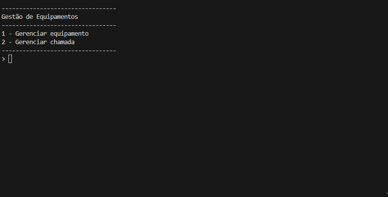

# Gestão de Equipamentos




## Introdução

Junior cuida do estoque de equipamentos na empresa onde trabalha. E sempre controla o inventário dos
seus equipamentos e as manutenções que eles já sofreram em uma planilha do Excel.
Desta forma, ele resolveu pedir ajuda do pessoal da Academia do Programador no desenvolvimento de um
Software para automatizar o seu serviço.

## Funções

1. Controle de Equipamentos
Requisito 1.1: Como funcionário, Junior quer ter a possibilidade de registrar equipamentos

* Deve ter identificador único (id);
* Deve ter um nome com no mínimo 3 caracteres;
* Deve ter um preço de aquisição;
* Deve ter uma fabricante;
* Deve ter uma data de fabricação;

Requisito 1.2: Como funcionário, Junior quer ter a possibilidade de visualizar todos os equipamentos
registrados em seu inventário.

* Deve mostrar o id;
* Deve mostrar o nome;
* Deve mostrar o preço;
* Deve mostrar a fabricante;
* Deve mostrar a data de fabricação;

Requisito 1.3: Como funcionário, Junior quer ter a possibilidade de editar um equipamento, sendo que ele
possa editar todos os campos.

* Deve ter os mesmos critérios que o Requisito 1.

Requisito 1.4: Como funcionário, Junior quer ter a possibilidade de excluir um equipamento que esteja
registrado.
* A lista de equipamentos deve ser atualizada

2. Controle de Chamados

Requisito 2.1: Como funcionário Junior quer ter a possibilidade de registrar os chamados de manutenções
que são efetuadas nos equipamentos registrados
* Deve ter um identificador único (id);
* Deve ter a título do chamado;
* Deve ter a descrição do chamado;
* Deve ter um equipamento;
* Deve ter uma data de abertura;

Requisito 2.2: Como funcionário Junior quer ter a possibilidade de visualizar todos os chamados registrados
para controle.
* Deve mostrar o título do chamado;
* Deve mostrar o equipamento;
* Deve mostrar a data de abertura;
* Número de dias que o chamado está aberto

Requisito 2.3: Como funcionário Junior quer ter a possibilidade de editar um chamado que esteja
registrado, sendo que ele pode editar todos os campos.

* Deve ter os mesmos critérios que o Requisito 2.1.
Requisito 2.4: Como funcionário Junior quer ter a possibilidade de excluir um chamado.

3. Controle de Fabricantes

Requisito 3.1: Como funcionário, Junior quer ter a possibilidade de registrar os fabricantes dos equipamentos
registrados.
* Deve ter um identificador único (id);
* Deve ter o nome do fabricante;
* Deve ter o email do fabricante;
* Deve ter o telefone do fabricante;

Requisito 3.2: Como funcionário Junior quer ter a possibilidade de visualizar todos os fabricantes registrados
8para controle.
* Deve ter o nome do fabricante;
* Deve ter o email do fabricante;
* Deve ter o telefone do fabricante;
* Deve ter a quantidade de equipamentos feitos pelo fabricante em registro;

Requisito 3.3: Como funcionário, Junior quer ter a possibilidade de editar um fabricante que esteja registrado,
sendo que ele possa editar todos os campos.
* Deve ter os mesmos critérios que o Requisito
 3.1.
Requisito 3.4: Como funcionário, Junior quer ter a possibilidade de excluir um fabricante.
Requisito 3.5: Como funcionário, Júnior quer ter a possibilidade de cadastrar novos equipamentos informando
o fabricante do mesmo.


## Como ultilizar

1. Extraia o arquivo GestaoDeEquipamentos.ConsoleApp do repositório com .zip;

2. Restaure as dependecias do projeto com o ```comando```:
```
dotnet restore
```
3. Agora va até o diretório raiz e execute no terminal com o ```comando```:
```
dotnet run --project  GestaoDeEquipamentos.ConsoleApp
```

## Requisitos

.NET SDK (versão 10)